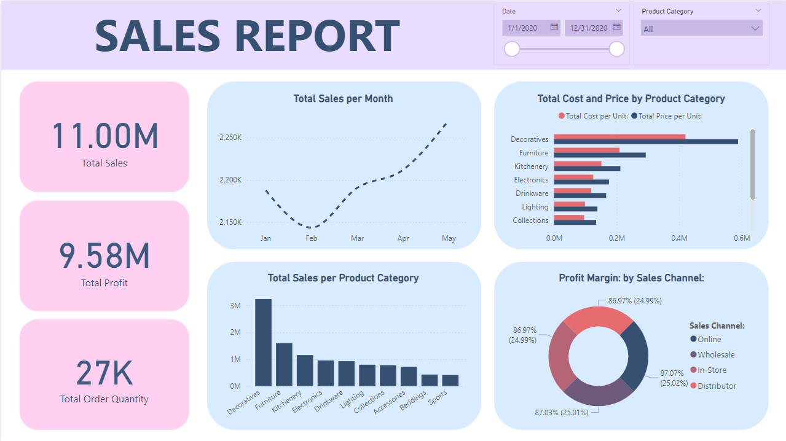

# Sales Report: Data Pipeline and Power BI Dashboard



This project creates a data pipeline to transform Excel sales data into interactive Power BI visualizations. A Python script extracts data from multiple Excel worksheets and loads it into a PostgreSQL database as individual tables. Power BI connects to the database to generate dynamic sales dashboards.

&nbsp;
## Data Flow
1. **Excel Data:** Multiple worksheets within an Excel file contain sales data.
2. **Python Script:**
    - Iterates through each Excel worksheet.
    - Creates corresponding tables in a PostgreSQL database.
    - Populates tables with data from each worksheet.
3. **PostgreSQL Database:** Stores processed sales data in multiple tables.
4. **Power BI:**
    - Connects to the PostgreSQL database.
    - Imports data for visualization.
    - Creates a sales dashboard.

&nbsp;
## Dependencies
- pandas
- sqlalchemy
- psycopg2
- openpyxl
- dotenv

&nbsp;
## Installation
1. Clone this repository.
```
https://github.com/cegjimenez/sales-report.git
```

2. Create a virtual environment.
```
python -m venv venv
```

2. Activate the virtual environment.
```
venv\Scripts\activate # Windows
source venv/bin/activate  # Linux/macOS
```

4. Install required dependencies.
```
pip install -r requirements.txt
```

5. Run the script:
```
python main.py
```  